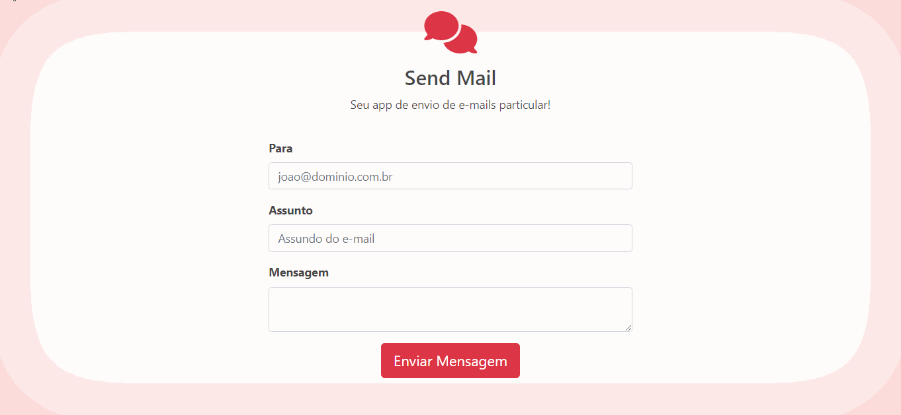

<h1 align="center">
    
    <p>Your private email sending app!<br> 
    Seu app de envio de e-mails particular!</p>
</h1>
<h3 align="center"><a href="#">See the project here!<br>
Veja o projeto aqui!</a></h3>
<hr>

<br>

## 📸 About
A project developed to improve the knowledge learned about PDO, try, catch, namespace and the incorporation of the PHPMailer library to send email through Gmail's SMTP service.

Um projeto desenvolvido para aprimorar os conhecimentos aprendidos do PDO, try, catch, namespace e a incorporação da biblioteca PHPMailer para enviar e-mail através serviço de SMTP do Gmail.

<br> 

## 🔧 Tools

- [Bootstrap 5](https://getbootstrap.com/docs/5.0/getting-started/introduction/)
- [PHP](https://www.php.net/)

<br>

## 💡 How contribute

```bash
    #clone the project
    $git clone https://github.com/Ester-Farias/Projeto-Send-Mail.git
```

```bash
    #Enter directory
    $ cd Projeto-Send-Mail
```

```bash
    #Install the dependencies, if use npm
    $ npm install
```
<p align="center">Or</p>

```bash
    #Install the dependencies, if use yarn
    $ yarn
```

## 📃 License
This project is under the MIT license. See the file [LICENSE](https://github.com/Ester-Farias/Portfolio-fotografo-rafael-silva/blob/master/LICENSE) for more details.